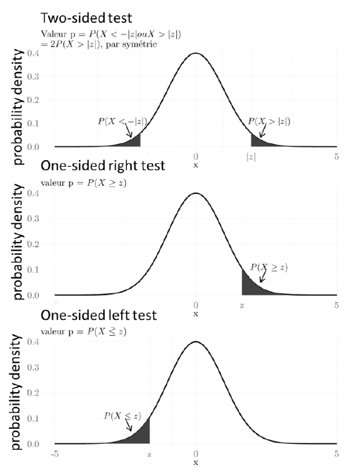
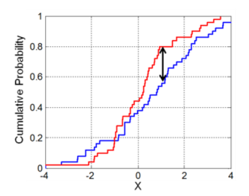

```{r setup, include=FALSE}
knitr::opts_chunk$set(cache=TRUE, error=FALSE, fig.cap = " ", message=FALSE, warning=FALSE)
```

------------------------------------------------------------------------

**Work organisation**

Before starting, register yourself in a working group (work by groups of 3) within the Engineering Hydrology working space in Chamilo.

**Data**

Mean monthly and mean annual discharge [m^3^/s] observed on the Loire River at Blois from 1863 to 2019 -- cf. `Loire_Blois_R.csv` (the data separator is ";"). Download the file `Loire_Blois_R.csv` from Chamilo into a chosen working directory.

**Report instructions**

A comprehensive report on the full Statistical Hydrology BE (Part I and Part II) will be due by November 4^th^. It should be dropped on Chamilo in Engineering Hydrology \> Travaux \> BE Statistical Hydrology. Your group number should appear in the file name. It will be graded.

The sections and subsections below provide the structure for your report. Once the analysis in R is ready, knit the document to Word and finalize its formatting. A comprehensive report should include:

-   a table of content
-   numbered figures and tables (if applicable)
-   a table of figures
-   a table of tables
-   references to figures and tables within the text
-   a list of the sources and references you used in your report (e.g. figures you downloaded, values/information you extracted from webpages/books/articles) -- these references should also appear in the text, next to the information taken from the reference.

**Reminder on how to include R code in your report**

In your reports, all commands run in R should appear (`echo=TRUE`) as well as results (`eval=TRUE`), unless you are (a) loading or installing a package, or (b) setting the path to a directory. All the text that does not correspond to R commands should be added outside chunks.

**Setup of the R environment**

To set up your R environment for both parts of the BE, you will need, in R, to:

1.  Install the 'fitdistrplus' library if it is not already installed
2.  Load the 'fitdistrplus' library `library('fitdistrplus')`
3.  Set the working directory to the location of your Loire_Blois_R.csv file `setwd`
4.  Check the working directory `getwd`

```{r echo=FALSE, eval=FALSE}
install.packages("fitdistrplus")
```

```{r echo=FALSE}
library(fitdistrplus)
```

**Setup of the RMarkdown package**

To set up RMarkdown:

1.  Install the 'stringi' package if it is not already installed. You can check in the package list on the righ panel of Rstudio. If a pop-up window opens, choose not to install from source (click `No`).
2.  Install the 'rmarkdown' package if it is not already installed.
3.  Load the 'rmarkdown' library
4.  Open the file BE1.Rmd in Rstudio
5.  Test the compilation by knitting to HTML
6.  Make sure that the line 'pdf_document: default' does not appear in your header (this will compile the document to pdf by default, which will fail on school computers)
7.  Pick the RMarkdown display in the top left corner of the text editor (Source/Visual)

```{r echo=FALSE, eval=FALSE}
install.packages("stringi")
```

```{r echo=FALSE}
library(stringi)
```

------------------------------------------------------------------------

# Part I -- Descriptive statistics and distribution fitting

## Objectives of Part I

-   To become familiar with descriptive statistics and plotting with R/RStudio
-   To become familiar with distribution fitting with R/RStudio
-   To become familiar with Q-Q and P-P plots

## Description of the Loire station at Blois

Add a brief description of the Loire station at Blois including at least:

-   who operates it

    The administrative responsibilities are fulfilled by **DREAL.**

-   its area (km^2^)

    Watershed area of the basin is **38,320** km².

-   a map of its location

    [@lemarchand2014][{width="467" height="268"}](IntechOpen. <https://doi.org/10.5772/57176>)

-   its mean annual discharge (m^3^/s) and annual runoff (mm)

    The mean annual discharge is **355 m3/sec** and annual runoff is **292 mm**

    [<https://www.hydro.eaufrance.fr/stationhydro/K447001001/synthese/regime/toutes-eaux>]

-   its mean annual precipitation (mm)

    The mean average precipitation is approximately **530mm** (calculated over a period of 20 years Data)

    [<https://en.tutiempo.net/climate/ws-72450.html>]

## Hydrological regime

Add information about the hydrological regime at the station including at least:

-   the lowest monthly discharge (value, time of year)

    As per figure below, the lowest monthly discharge is in **August** of **117m^3^/sec**

-   the highest monthly discharge (value, time of year)

    As per figure below, the lowest monthly discharge is in **February** of **583m^3^/sec**

-   the timing of high and low waters and your conclusions on the type of flow regime

    From the picture below it could be observed that High waters are observed in winter, and low waters in summer, therefore the Loire river corresponds to a flow regime of a ***Perennial river system .***

-   A figure of the annual flow regime.

    {width="612" height="343"}

## Analysis on annual stream flow

### Stream flow data structure

-   Read the `Loire_Blois_R.csv` file (using the function `read.csv`) and store the data set into a variable called `Data`. Choose the `sep` and `header` arguments carefully. You can find more information on the `read.csv` function by typing `?read.csv`.

```{r}
data <- read.csv("Loire_Blois_R.csv", header = TRUE, sep = ";" )
```

-   Display the internal structure of the data you just loaded using the function `str`

```{r}
str(data)
```

Write a paragraph to answer the following questions:

-   How many variables are there in the Data data.frame?

    There are **14 variables** in the data frame

-   What is the name of each variable?

```{r}
variable.names(data)
```

-   Which is the type of each variable?

```{r}
lapply(data,class)
```

-   How many observations are there of each variable?

There are **154** observation in the each variable.

### Descriptive statistics

-   Fill in the command below to display the annual stream flow as a function of the year. Add labels to your axes, indicating units when necessary. Set the y-axis limits between 0 and 1224 m^3^/s.

```{r}
library(viridis)
plot(data$Year, data$Annual, xlab = 'Year', ylab = 'Annual Flows (m3/sec)', main = "Annual Stream Flow", col.lab = "Black", pch = 19, col = viridis(n=256, option = "H"), bg = "Yellow", font.lab = 2, bty= "n", cex.axis = 0.9)

```

-   Using the function `plot`, display the October stream flow as a function of the year. Add labels to your axes and set the y-axis limits between 0 and 1224 m^3^/s.

```{r}
plot(data$Year, data$Oct, xlab = 'Year', ylab = 'October Flows (m3/sec)', main = "October Stream Flows", col.lab = "Black", pch = 18, cex= 1,col = viridis(n=256, option = "D"), bg = "Yellow", font.lab = 2, bty= "n", cex.axis = 0.9, ylim = c(0,1224), xlim = c(1863,2019)) 
```

-   Display the annual stream flow against the October stream flow. Add labels to your axes. Add a 1:1 line.

```{r}
plot(data$Annual, data$Oct, xlab = 'Annual Flow', ylab = 'October Flow', main = "Average Annual October Stream Flow", col.lab = "Black", pch = 19, col = viridis(n=256, option = "D"), bg = "Yellow", font.lab = 2, bty= "n", cex.axis = 0.9, ylim = c(0,1224)) 
abline(a = 0, b = 1, col = "Purple", lwd = 2.5)
```

-   Calculate the main statistical descriptors of the annual stream flow using the function `summary`.

```{r}
summary(data$Annual)
```

-   Calculate the standard deviation in annual stream flow. Use `?sd` to see how to handle missing values.

```{r}
sd(data$Annual, na.rm = T)
```

Write a paragraph to summarize your results and answer the following questions:

-   How many missing values (NA) are there?

    There are **6** missing values in the data.

Write a paragraph to summarize the obtained results.

The first graph (annual stream flow as a function of the year) shows year wise annual flows, from the graph we see that there are two values above the **600 m3/sec** flows in the period of 156 years most of the flow values are concentrated between **200m3/sec** to **550 m3/sec.** From graph (October flows), it can be observed that in the late 19th Century month of October observed high flows -- above **400m3/sec** as compared to recent years (late 20th century) where majority of flow values are concentrated below the **400m3/sec** mark. The statistical description of the data set shows that the data has skewness and will not perfectly follow the normal law and it could be deduced from the 1st quartiles that 25 % of the data set values are below 282 m3/sec and 75 % of the values are above it similarly from the 3rd quartile we can say that 75 % of the values are below 430 m3/sec and only 25 % are above it which gives better indication about the normal flow values. The percentage difference between the Standard deviation **(104.41 m3/sec)** and the mean **(359 m3/sec)** is calculated to be 70 % which shows that majority of data values are closer to the mean values.

### Empirical distribution

-   Display a box plot of the annual stream flow. Display the statistics displayed in the box plot. See `boxplot` and `boxplot.stats`.

```{r}
boxplot(data$Annua, col = "green", border = par("fg"))
boxplot.stats(data$Annual)

```

-   Identify the indices of annual stream flow values that are missing. To that effect, you will look into the functions `is.na` and `which`.

```{r}
is.na(data$Annual) # is.na function looks for na values and appears true for that position.
```

```{r}
which(is.na(data$Annual)) # this gives the location of missing values

```

```{r}
!is.na(data$Annual) #! reverses the values from true to false: - so this gives the location which are not NA
```

-   Create a new vector `annual_Q_without_NA` containing only the annual stream flow values that are not missing.

```{r echo=FALSE, eval= FALSE}
 # which(!is.na(data$Annual)) # generate a vector which gives the location of not missing values and when  this vector is enclosed in data$annual it gives values corresponding for those positions. similar to data$annual[1] gives the value for 1 position.
```

```{r}
annual_Q_without_NA <-data$Annual[which(!is.na(data$Annual))] 
```

-   Plot the empirical histogram, teh empirical density and the empirical cumulative distribution using the function `plotdist` of the `fitdistrplus` package. Look into the options `histo` and `demp`.

```{r}
plotdist(annual_Q_without_NA, histo = TRUE, demp = TRUE, col = viridis(n=154, option = "E"), pch = 20, type = "b" , lty = "solid", font.lab = 2, bty= "n", cex.axis = 0.9,)

```

Write a paragraph to summarize your results and answer the following questions:

-   How are the lower and the inner fence of the box plot calculated? Look at the help by typing ?box plot.

The two fences are calculated as follows

Upper fence = Q3 + (1.5 \* IQR)

Lower fence = Q1 -- (1.5 \* IQR)

where,

Q3 = Upper Quantile (75%)

Q1= Lower Quantile (25%)

-   Comment the obtained results.

Box plot is a graphical representation of the data and box plot.stat function gives t*he \$stats which define the statistical parameters of the box plot which are **124.180 281.445 362.820 430.370 649.580** (min, 1st quartile, median, 3rd quartile and Max respectively) ,* **\$n** represents the non-zero observations which were counted as **148**, **\$conf** defines the two values from the notch (median) and \$out defines the outlier value which is given as **727.92.** These results are similar to the ones produced by the **summary** function in descriptive statistic sub-section under Analysis on Annual Stream Flow . However, from the box plot we cannot deduce the pattern of distribution, for which histogram was plotted and density plot was superimposed on it which demonstrates that the histogram follows a nearly normal law pattern, but to confirm this hypothesis we will fit different distributions on the data.

### Distribution fitting on annual stream flow

-   Use the function `fitdist` of the `fitdistrplus` package to fit successively a normal, log normal and gamma distribution to the annual streamflow (from which missing values were removed). You will use the moment matching estimation method for the fitting.

```{r}
norm_fit <-  fitdist(annual_Q_without_NA, distr = "norm", method = "mme")

gamma_fit <- fitdist(annual_Q_without_NA, distr = "gamma", method = c("mme"))

lognormal <- fitdist(annual_Q_without_NA, distr = "lnorm", method = c("mme"))
```

-   Create a list containing all three fits.

```{r}
all_fits <- list(norm_fit, gamma_fit, lognormal)
```

-   Plot and compare the fitted density functions using `denscomp` and the list you created. Add a legend to identify each fit.

```{r}
denscomp(all_fits, datacol = viridis(7, option = "H"), fitlwd = 2)
```

-   Plot and compare the fitted distributions using `cdfcomp` and the list you created. Add a legend to identify each fit.

```{r}
cdfcomp(all_fits, datapch = 20, datacol = viridis(10, option = "H"), fitlwd = 1)
```

-   Create a quantile-quantile plot and a probability-probability plot using the list you created and the functions `qqcomp` and `ppcomp`. Add legends to identify the fits.

```{r}
qqcomp(all_fits, fitpch = 19, fitcol = viridis(5, option = "H"))
ppcomp(all_fits, fitpch = 20, fitcol = viridis(3, option = "C"))
```

-   Comment the obtained results by comparing the different fits based on the graphs you produced.

    With the ***denscomp*** function, the density distribution was plotted for each fitted distribution, normal fitted distribution was more coherent at the peak than the other two fitted distribution, but then the **gamma** and **log normal** distribution were coherent with the data at the **tail**. Similarly the cumulative distribution frequency was plotted for empirical distribution ( by default uses Hazen\`s rule for the plotting positions) and for each fitted distribution and this plot further affirms the statement that gamma and log normal distribution is in more conjunction with the data at the tails. Q-Q plot compares the proximity of empirical quantiles (found from the data) with the theoretical quantiles, from the Q-Q plot we can deduce the quantiles of the data (empirical quantiles) are in more proximity with the **Gamma fitted distribution**. P-P plot is plotted to see the fit of data with the distribution or how closely the empirical probabilities align with the fitted model, but here in this case it seems that all three models (normal, gamma and log normal) predicts the same probabilities as predicted by empirical models.

-   Get the distributions parameters of each fit obtained with the moment matching estimation method using `summary`

    ```{r}
    summary(norm_fit)
    summary(gamma_fit)
    summary(lognormal)
    ```

-   The log likelihood, the Aikake Information Criterion (AIC) and the Bayesian Information Criterion (BIC) are measures of goodness-of-fit. The higher the log likelihood, the better the fit. The lower the AIC and BIC, the better the fit. based on these criteria, which is the best fit for the Loire annual discharge at Blois?

    Based on the above summary, it is concluded that **gamma distribution** is the best fit for the Loire Annual Discharge as it has lower AIC and BIC (**1796.442** & **1802.436** ) respectively, as compared to the measures of other distribution.

<!-- -->

-   Use the function `fitdist` to fit successively a normal, log normal and gamma distribution to the annual stream flow (from which missing values were removed), this time based on the maximum likelihood method.

    ```{r}
    norm_fit1 <- fitdist(annual_Q_without_NA, distr = "norm", method = c("mle"))

    gamma_fit1 <- fitdist(annual_Q_without_NA, distr = "gamma", method = c("mle"))

    lognormal1 <- fitdist(annual_Q_without_NA, distr = "lnorm", method = c("mle"))

    all_fits1 <- list(norm_fit1,gamma_fit1,lognormal1)
    ```

-   Get the distributions parameters of these new fits using `summary`

    ```{r}
    summary(norm_fit1)
    summary(gamma_fit1)
    summary(lognormal1)
    ```

-   Compare the parameters and goodness-of-fit measures obtained based on the two parameter estimation methods. Comment.

    We observe that when the estimation method is changed from **Moment Method Estimation (mme)** to Maximum **Likelihood Estimation (mle)** the log likelihood, AIC and BIC values changes but not significantly and still after changing of estimation method the AIC and BIC for Gamma distribution is the lowest ( 1796.304 & 1802.299) respectively. Hence till this point of the analysis It is of the opinion that Annual data set is best fitted by **Gamma distribution**.

## Analysis on monthly stream flow

Depending on your Chamilo group number, you will work on the following monthly data:

```{r,echo=FALSE}
data1 <- data.frame(Group = 1:24, Month = month.abb)
knitr::kable(t(data),caption = "", row.names = F)
```

-   Plot the series of monthly discharge for month **February**.

    :- Note our Group is working for February Flows.

    ```{r}
    plot(data$Year, data$Feb, xlab = 'Year', ylab = 'February Flows (m3/sec)', main = "February Stream Flows VS Years", col.lab = "Black", pch = 18, cex= 1,col = viridis(n=100, option = "H"), bg = "Yellow", font.lab = 2, bty= "n", cex.axis = 0.9, ylim = c(0,1600), xlim = c(1863,2019))
    ```

-   Analyse the distribution of monthly discharge in month **February.**

    ```{r}
    Feb_Q_without_NA <- data$Feb[which(!is.na(data$Feb))] 
    print(Feb_Q_without_NA)
    ```

    ```{r}
    plotdist(Feb_Q_without_NA, histo = TRUE, demp = TRUE, col = viridis(n=5, option = "E"), pch = 20, type = "b" , lty = "solid", font.lab = 2, bty= "n", cex.axis = 0.9,) 
    ```

    ```{r}
    summary(data$Feb)
    ```

From the above graph we can conclude that the February flow data corresponds to **positively skewed distribution** as majority of values cluster to the left tail and right tail is longer. The summary of the data further confirms this statement as for the case of positively skewed data **mean \> median.**

-   Fit a normal, log normal and gamma distribution to these data by the moment matching estimation (MME) method. Plot the corresponding results. Comment.

    ```{r}
    norm_fit2 <-  fitdist(Feb_Q_without_NA, distr = "norm", method = "mme")

    gamma_fit2 <- fitdist(Feb_Q_without_NA, distr = "gamma", method = c("mme"))

    lognormal2 <- fitdist(Feb_Q_without_NA, distr = "lnorm", method = c("mme"))

    all_fits2 <- list(norm_fit2, gamma_fit2, lognormal2)

    denscomp(all_fits2, datacol = viridis(5, option = "H"), fitlwd = 2)

    cdfcomp(all_fits2, datapch = 20, datacol = viridis(10, option = "H"), fitlwd = 1)

    qqcomp(all_fits2, fitpch = 19, fitcol = viridis(5, option = "H"))

    ppcomp(all_fits2, fitpch = 20, fitcol = viridis(3, option = "C"))

    ```

*From the plots we see that normal distribution is not a good fit for February flows but graphically it can be concluded that gamma and log normal almost predicts the same.*

-   Choose one of the three fitted distributions as representative of the monthly discharge at Blois. Justify your choice. Give the distribution parameters of such distribution.

```{r}
summary(norm_fit2)
summary(gamma_fit2)
summary(lognormal2)
```

In order to choose between the Gamma and Log normal, measures of goodness-fit-test were computed and by the aid of it, **Gamma distribution** is selected as representative for the month of February flows. The choice was made on the basis of lower values of AIC and BIC which for the gamma distribution were **2132.135** & **2138.182** respectively, which in comparison to other two fitted distribution (Normal and Log normal ) are lower .The parameters for representative distribution are **Shape = 3.919727682** and **Rate = 0.006739509.**

-   In the first part of **February** this year, the mean Loire River discharge at Blois was around 165 m^3^/s. Supposing that the average at the end of the month is 165 m^3^/s, what is its probability? What must be the average discharge in the next 15 days to reach the expected value in **February** at Blois? Comment.

    ```{r}
    pgamma(165, shape = 3.919727682, rate = 0.006739509)
    ```

The probability of getting **165 m3/sec** in the month of February this year is approximately **3 %** and the soluton to find the average discharge is as follows:

Considering a discharge of 165 m3/s in the first part of February, to get the average discharge (x) in the next 15 days to reach the expected value in February at Blois (210.6 m3/s), we evaluate thus; $$μ(Feb) = [16μ(Feb 2020)+ 15x]/28$$

where μ(Feb 2020)=165 m3/s μ(Feb) = 581.60 m3/s and x is the expected discharge of the next 15 days found to be **942 m3/s**.

-   Give an estimate of the probability of the current monthly value of 170 m^3^/s.

    ```{r}
    pgamma(170, shape = 3.919727682, rate = 0.006739509)
    ```

    The probability of getting 170m3/sec is **3.27 %.**

------------------------------------------------------------------------

# Part II -- Statistical tests

## Objectives of Part II

-   To become familiar with the use of statistical tests with R/RStudio
-   To apply conformity and homogeneity tests on the mean and the variance: Student's, Wilcox (or Mann-Whitney) and Fisher-Snedecor tests
-   To apply goodness-of-fit tests: Pearson's \$\\chi\$^2^ and Kolmogorov-Smirnov's tests

## Short reminder on statistical tests

The different types of statistical tests depending on the objectives:

-   **Conformity tests** allow the comparison of a characteristic of a sample (such as mean, standard deviation, ...) with a reference value (or norm)
-   **Homogeneity tests** allow comparing two data samples
-   **Goodness-of-fit tests** check if a given sample can be considered as coming from a specific parent population (distribution)
-   **Stationarity tests** include trend tests for highlighting a slow drift in the process and change point tests for identifying abrupt changes from a given date
-   **Autocorrelation tests** verify whether there is a statistical temporal dependence between datasets
-   **Parametric tests**: we know or assume that a particular parametric distribution (such as the normal law) is an appropriate representation for the data and/or the test statistic. A parametric test concerning a physical process of interest can reduce to a test pertaining to a distribution parameter (such as the normal mean or the normal standard deviation)
-   **Non-parametric (or distribution-free) tests**: are conducted without assumptions that particular parametric forms are appropriate in a given situation

The **5 steps** of any hypothesis test:

1.  Identify a **test statistics** that is appropriate to the data and the question at hand
2.  Define a **null hypothesis H~0~**
3.  Define an **alternative hypothesis H~1~**
4.  Obtain the **null distribution**, which is the sampling distribution for the test statistics if the null hypothesis H~0~ is true
5.  Compare the observed test statistics to the null distribution. If the test statistic falls in a sufficiently improbable region of the null distribution, **H~0~ is rejected**. If the test statistic falls within the range of ordinary values described by the null distribution, the test statistic is seen as consistent with H~0~, which is then **not** rejected.

The significance level $\alpha$ (also called the rejection level or the test level) corresponds to a threshold probability (i.e. an accepted probability) of incorrectly rejecting the null hypothesis when it is in fact true. It is also known as the type I error and is associated to one (in the case of a one-sided test) or two (in the case of a two-sided test) critical value(s) delimitating the rejection interval(s).

Each test statistic is characterized by a given test variable whose observed value is associated to a probability called the p-value. The p-value corresponds to the observed rejection probability of the null hypothesis (i.e. the black areas in the figure at left).



In a **one-sided test**, the null hypothesis is rejected at a level of significance $\alpha$ if the p-value is greater than 1 -- $\alpha$ (the test value is greater than the critical value in a one-sided right test) or lower than $\alpha$ (the test value is lower than the critical value in a one-sided left test).

In a **two-sided test**, the null hypothesis is rejected at a level of significance $\alpha$ if the p-value is lower than $\alpha$/2 (the test value is lower than the left critical value) or greater than 1 - $\alpha$/2 (the test value is greater than the right critical value).

The **confidence interval** (1-$\alpha$) of the test corresponds to the uncertainty on the observed values at a given significance level $\alpha$. The null hypothesis is rejected if the confidence interval excludes the null hypothesis value. $\alpha$ = 5% is often chosen as significance level, corresponding to a 95% confidence interval.

## Conformity test on annual data

A diatribe pits two hydrological experts against each other. The first states that the module (i.e. the interannual mean value) of the Loire River at Blois is 370 m3/s. The other one states that it is rather less than this value. We use a statistical test based on the available data set in order to determine who is right.

1.  Calculate the module [m3/s] of the Loire River at Blois.

```{r}
mean(annual_Q_without_NA)
```

A common conformity test used for comparing the mean of a normally distributed sample to a reference value is the Student's t-test. The t-test variable is defined as $$t=\sqrt{n}\frac{m-\mu}{s}$$ Where $n$ is the sample size, $m$ is the mean of the sample values, $\mu$ is the reference (theoretical) mean value and $s$ is the standard deviation of the sample values. The number of degrees of freedom is $n-1$.

In R, the Student test is applied using the function `t.test()`. Look at the help to understand the syntax of this function and how it works: type `?t.test` in the prompt.

2.  Give H~0~ (the null hypothesis) and H~1~ (the alternative hypothesis) in the case of the t-test.

    H~0,~ $\mu$ = 370 m3/sec.

    H~1,~ $\mu$ \<= 370 m3/sec.

3.  Do you need a single or a two-sided test for answering the question?

    We need a **single sided** test for answering this question.

4.  Perform the following Student's t-test and comment the results.

```{r}
# level of significance = 5%
t.test(data$Annual, mu=370, alternative= "less", conf.level=0.95)
```

The student test gives **-1.2867,** as test statistic and test has 147 degree of freedom, as the value of test statistic is small so we can roughly infer that sample mean is equal to 370m3/sec The p-value corresponding to test statistic is **0.10** or **10 %.**

5.  Is H~0~ rejected at a level of significance $\alpha$ of 5%?

Since the **P-value = 10%** and is greater than the level of significance $\alpha$ of 5% , so we **fail to reject the null hypothesis** and we can say that there is no significant difference in the sample and theoretical mean i.e $\mu$ = 370 m3/sec.

6.  Same questions for a two-sided test.

In the case of two sided test . The null and alternative hypothesis could be written as following:

H~0,~ $\mu$ = 370 m3/sec

H~1,~ $\mu$ != 370 m3/sec.

```{r}
# level of significance = 5%
t.test(data$Annual, mu=370, alternative= "two.sided", conf.level=0.95)
```

Since the **P-value = 20%** and is greater than the level of significance $\alpha/2$ = 2.5% and less than $1-\alpha/2$ = 97.5%, so we **fail to reject the null hypothesis** and we can say that there is no significant difference in the sample and theoretical mean. i.e $\mu$ = 370 m3/sec

## Homogeneity tests on annual data

The inhabitants of Blois are divided as to whether or not the regime of the Loire River has changed over time. Some say that the module has changed over the last 30 years, while others say that it is the inter-annual variability that has changed. As a hydrologist, you suggest tests to them to provide a scientific basis for the discussion. Indeed, we will use two statistical tests, one applied on the **module (i.e. the inter annual mean)** and the other applied on the **variance**, both calculated over two different periods: 1950-1979 and 1990-2019.

First, we will test the module. An appropriate test for comparing the means of two samples is the Student's t-test if the two samples are normally distributed and have the same variance. In this case, the t-test variable is defined as: $$t=\frac{m_1-m_2}{\sqrt{\frac{s^2(n_1+n_2)}{n_1 n_2}}}$$ Where $n_1$ and $n_2$ are the sample sizes of the two samples, $m_1$ and $m_2$ are the means of the two sample values ad $s$ is calculated as: $$s^2=\frac{(n_1-1)s_1^2+(n_2-1)s_2^2}{n_1 + n_2 - 2}$$ Where $s_1^2$ and $s_2^2$ are the variances of the two sample values. The number of degrees of freedom is $n_1+n_2-2$.

1.  Calculate the module [m^3^/s] of the Loire River discharge during the two periods 1950-1979 and 1990-2019.

```{r}
mean(data$Annual[88:117] , na.rm = T) # for period for, 1950-1979
```

```{r}
mean(data$Annual[128:154], na.rm = T) # for period for, 1990-2019
```

2.  Give H~0~ and H~1~ in the case of this t-test.

H~0,~ $\mu1$ = $\mu2$

H~1,~ $\mu1$ != $\mu2$

3.  Test the homogeneity of the Loire River modules during 1950-1979 and 1990-2019:

```{r}
t.test(data$Annual[88:117], data$Annual[128:154], conf.level=0.95)
```

4.  Is it rejected or not at a level of significance $\alpha$ = 5%?

Since the **P-value = 14%** and is greater than the level of significance $\alpha/2$ of 2.5% and less than $1-\alpha/2$ of 97.5%, so we **fail to reject the null hypothesis** and we can say that there is no significant change in the module of two samples i.e $\mu1$ = $\mu2$.

Secondly, we will test the variance, which is an indicator of interannual variability. An appropriate test for comparing the two samples variances is the Fisher-Snedecor test. The $F$ variable is defined as: $$F=\frac{\frac{n_1s_1^2}{n_1-1}}{\frac{n_2s_2^2}{n_2-1}}$$ where $n_1$ and $n_2$ are the sample sizes of the two samples, $m_1$ and $m_2$ are the means of the two sample values, $s_1^2$ and $s_2^2$ are the variances of the two sample values. The number of degrees of freedom is $n_1+n_2-1$.

4.  Calculate the variance [m^3^/s] of the Loire River discharge during the two periods 1950-1979 and 1990-2019.

```{r}
var(data$Annual[88:117])  # for period for, 1950-1979
```

```{r}
var(data$Annual[128:154], na.rm = T) # for period for, 1990-2019
```

5.  Give H~0~ and H~1~ in the case of the Fisher-Snedecor test.

H~0,~ $s_1^2$ = $s_2^2$

H~1,~ $s_1^2$ ~!=~ $s_2^2$

6.  Test the homogeneity of the variances of the Loire River discharge during 1950-1979 and 1990-2019:

```{r}
var.test(data$Annual[88:117], data$Annual[128:154], conf.level=0.95)
```

What is your conclusion considering as before a significance level $\alpha$ = 5%?

Since the **P-value = 41%** and is greater than the level of significance $\alpha/2$ of 2.5% and less than 1-$\alpha/2$ of 97.5% , so we **fail to reject the null hypothesis** and we can say that there is no significant change in the inter annual variability of two samples i.e true ratio of variances is equal to 1 OR $s_1^2$ = $s_2^2$

## Goodness-of-fit tests on monthly data

In Part I you fitted a Normal, a LogNormal and a Gamma law to the data series of monthly mean river discharge [m^3^/s] observed on the Loire River at Blois.

1.  Recall the fitted parameter values for the three statistical laws by the maximum likelihood estimation (MLE) method.

```{r}
summary(norm_fit1)
summary(gamma_fit1)
summary(lognormal1)
```

An appropriate test for the goodness-of-fit assessment is the Kolmogorov-Smirnov test, whose test variable D is the maximum distance between the empirical probability distribution and the fitted theoretical one:



The general expression of the Kolmogorov-Smirnov test in R is the following:

ks.test(empirical_dataset, "prob_distribution", par1, par2)

e.g. for the gamma law in the case of October:

OctQ_withoutNA \<- Data$Oct[-which(is.na(Data$Oct))] ks.test(OctQ_withoutNA, "pgamma", 1.8312, 0.0087)

```{r}
ks.test(annual_Q_without_NA, "pnorm", 358.9568, 104.0541)
```

```{r}
ks.test(annual_Q_without_NA, "pgamma", 11.41056780, 0.03178586)
```

```{r}
ks.test(annual_Q_without_NA, "plnorm", 5.838737	, 0.305537)
```

2.  What is the result of a Kolmogorov-Smirnov test on the three statistical laws fittings?

From the KS test we conclude the same as we concluded from **Graphical representation (Q-Q plots)** and through **measures of goodness-of-fit** that the sample distribution fits with the gamma distribution. Here we affirm the same conclusion by comparing the D-values for the 3 distribution, as the D-value is the least for gamma distribution i.e **D = 0.061372** we can say that the sample distribution come from the gamma distribution.

## Work on other monthly data and write a report

Continue working with the month corresponding to your group number.

-   Perform a goodness-of-fit test for the retained fitted distribution of Part I.

```{r}
summary(norm_fit2)
summary(gamma_fit2)
summary(lognormal2)
```

```{r}
ks.test(Feb_Q_without_NA, "pnorm", 581.6043	, 293.7648)
```

```{r}
ks.test(Feb_Q_without_NA, "pgamma", 3.919727682, 0.006739509)
```

```{r}
ks.test(Feb_Q_without_NA, "plnorm", 6.2521749, 0.4766875)
```

From the goodness Fit test we conclude that the Gamma Distribution fits the February Flow data which is the same conclusion as derived in the Part 1 of the report. The conclusion has been made on the fact that the value of **D = 0.051622** is the lowest for gamma distribution.

-   Perform a homogeneity test on your study monthly discharge series, considering the following periods: 1910-1939, 1950-1079, 1990-2019 and a reference global period 1863-2019.

```{r}
# Sample Mean
mean(data$Feb[48:77] , na.rm = T) # For 1910-1939
mean(data$Feb[88:117] , na.rm = T) # For 1950-1079
mean(data$Feb[128:154] , na.rm = T) # For 1990-2019
```

**Null hypothesis & Alternative Hypothesis.**

*For T test*.

H0, $\mu1$ = $\mu2$

H1, $\mu1$ != $\mu2$

*For Fisher-Snedecor Test*

H0, $s_1^2$ = $s_2^2$

H1, $s_1^2$ != $s_2^2$

```{r}
# Student Test on Mean.
t.test(data$Feb[48:77],data$Feb, conf.level=0.95) # For 1910-1939
t.test(data$Feb[88:117],data$Feb, conf.level=0.95) # For 1950-1079
t.test(data$Feb[128:154],data$Feb, conf.level=0.95) # For 1990-2019
```

For all three periods the **P-Values** are greater than $\alpha/2$= 2.5% and less than 1-$\alpha/2$ = 97.5 at a significance level of $\alpha$ = 5%. So for all the three periods we conclude that there is no significant change in the mean.

```{r}
# Fisher-Snedcor Test on Variability
var.test(data$Feb[48:77],data$Feb, conf.level=0.95)# For 1910-1939
var.test(data$Feb[88:117],data$Feb, conf.level=0.95)# For 1950-1079
var.test(data$Feb[128:154],data$Feb, conf.level=0.95)# For 1990-2019
```

For all three periods the P-Values are greater than $\alpha/2$= 2.5% and less than 1-$\alpha/2$ = 97.5% at a significance level of $\alpha$ = 5%. So for all the three periods we conclude that there is no significant change in the variability.

-   Complete the report from Part I with:

    -   On the basis of the goodness-of-fit test performed above, how do you evaluate your fitting? What is the expected value of the Loire River discharge for your studied month? What is the 10-year return value? What is the probability of the 2019 value?

*From the goodness Fit test we conclude that the Gamma Distribution fits the February Flow data which is the same conclusion as derived in the Part 1 of the report under Analysis on monthly stream flow from the graphical and measures of goodness-of-fit.*

```{r}
summary(gamma_fit2)
```

```{r}
# expected value from the fitting for the month of February using the matching moments 
# exp_value_gamma <- shape*1/rate
exp_value_Feb_gamma <- (3.919727682)*(1/0.006739509)
exp_value_Feb_gamma
```

The expected value($\mu$) from the gamma distribution is **581.6043 m3/sec**, which approximates the value of **581.6m3/sec** of the sample mean. From this it could be evaluated that gamma distribution is the best fit for the sample distribution.

```{r}
P <- 1-1/10
qgamma(P,3.919727682,0.006739509)
```

The value of discharge for 10 year return period from the fitted distribution is **975.393 m3/sec**

```{r}
pgamma(341.63, 3.919727682,0.006739509)
```

The probability of getting **341.63 m3/sec** discharge value of 2019 is **21.4%**

An analysis of the stationarity of your studied monthly discharge: what is the best fit on the 3 sub-periods?

```{r}
 # For 1910-1939 
norm_fit3 <-  fitdist(data$Feb[48:77], distr = "norm", method = "mme")

gamma_fit3 <- fitdist(data$Feb[48:77], distr = "gamma", method = c("mme"))

lognormal3 <- fitdist(data$Feb[48:77], distr = "lnorm", method = c("mme"))
```

```{r}
summary(norm_fit3)
summary(gamma_fit3)
summary(lognormal3)
```

```{r}
ks.test(data$Feb[48:77], "pnorm", 536.9553,257.9225)
ks.test(data$Feb[48:77], "pgamma", 4.3340907,0.008071604)
ks.test(data$Feb[48:77], "plnorm",6.1821116	,0.45563)
```

```{r}
#1950-1979
norm_fit4 <-  fitdist(data$Feb[88:117], distr = "norm", method = "mme")

gamma_fit4 <- fitdist(data$Feb[88:117], distr = "gamma", method = "mme")

lognormal4 <- fitdist(data$Feb[88:117], distr = "lnorm", method = "mme")
```

```{r}
summary(norm_fit4)
summary(gamma_fit4)
summary(lognormal4)
```

```{r}
ks.test(data$Feb[88:117], "pnorm", 677.1387,321.6364)
ks.test(data$Feb[88:117], "pgamma",4.432257084,0.006545568)
ks.test(data$Feb[88:117], "plnorm",6.4161532,0.4510496)
```

```{r}
# For 1990-2019
Feb_Q_1990_2019_without_NA <- data$Feb[which(!is.na(data$Feb[128:154]))] 
print(Feb_Q_1990_2019_without_NA)
```

```{r}
norm_fit5 <-  fitdist(Feb_Q_1990_2019_without_NA, distr = "norm", method = "mme")

gamma_fit5 <- fitdist(Feb_Q_1990_2019_without_NA, distr = "gamma", method = c("mme"))

lognormal5 <- fitdist(Feb_Q_1990_2019_without_NA, distr = "lnorm", method = c("mme"))
```

```{r}
summary(norm_fit5)
summary(gamma_fit5)
summary(lognormal5)
```

```{r}
ks.test(Feb_Q_1990_2019_without_NA, "pnorm",554.7677,236.3011)
ks.test(Feb_Q_1990_2019_without_NA, "pgamma",5.511767488,0.009935271)
ks.test(Feb_Q_1990_2019_without_NA, "plnorm",6.2351867,0.4083204)
```

From the above observation we can conclude that for the period **1910-1939**, p-values for all the three distribution are greater than $\alpha/2$ = 2.5% and less than 1-$\alpha/2$ = 97.5% at a significance level of $\alpha$ = 5%, so on the basis of lower D value of Gamma Distribution among all other distribution it is considered best for that period, but for the other two periods **1950-1979, 1990-2019** the p-value for the gamma and log normal distribution are greater than 1-$\alpha/2$ = 97.5% at a significance level of $\alpha$ = 5%, so we reject the hypothesis that these periods come from those distribution and for the two periods Normal distribution is the best fit.

Compare the parameters of the fitted laws and analyze the test results obtained above: is the series homogeneous.

The parameters for the 3 periods are:

**1910-1939**\
*Normal Distribution*---------*Gamma Distribution*--------*Lognormal Distribution*\
mean 536.9553-----------------shape 4.334090797-----------meanlog 6.1821116\
sd 257.9225-------------------rate 0.008071604------------sdlog 0.4556387

**1950-1979**\
*Normal Distribution*---------*Gamma Distribution*--------*Lognormal Distribution*\
mean 677.1387-----------------shape 4.432257084-----------meanlog 6.4161532\
sd 321.6364-------------------rate 0.006545568------------sdlog 0.4510496

**1990-2019**\
*Normal Distribution*---------*Gamma Distribution*--------*Lognormal Distribution*\
mean 554.7677-----------------shape 5.511767488-----------meanlog 6.2351867\
sd 236.3011-------------------rate 0.009935271------------sdlog 0.4083204

From the above summarized data, it can be observed that the parameters for three periods for the monthly flow series vary from each other, but the homogeneity test on the three periods suggest that there is no significant change in the mean and variability and thus the series is homogeneous.

What is the expected value of the Loire River discharge for your studied month considering only the last 30 years for the fitting?

```{r}
Feb_Q_1989_2019_without_NA <- data$Feb[which(!is.na(data$Feb[127:154]))]
Feb_Q_1989_2019_without_NA
```

```{r}
gamma_dist30 <- fitdist(Feb_Q_1989_2019_without_NA,distr = "gamma",method = "mme")
summary(gamma_dist30)
```

```{r}
 # exp_value  = (shape*1/rate)
exp_value <- (4.984353354	* 1/0.009304336)
exp_value
```

The expected value of discharge for data series of 30 years calculated by using the parameters of gammma distribution is **535.7022 m3/sec**.

What is the 10-year return value? What is the probability of the 2019 value? Comment.

```{r}
qgamma(P, 4.984353354,0.009304336)
pgamma(212.5, shape = 4.984353354, rate = 0.009304336)
```

The 10 year return value from the distribution of 30 years is **856.9466 m3/sec** The probability of 2019 value of **212.5m3/sec** for 30 year data series gamma distribution is **5%**.

------------------------------------------------------------------------

## References

Use this section to list the sources you refer to in your report.
