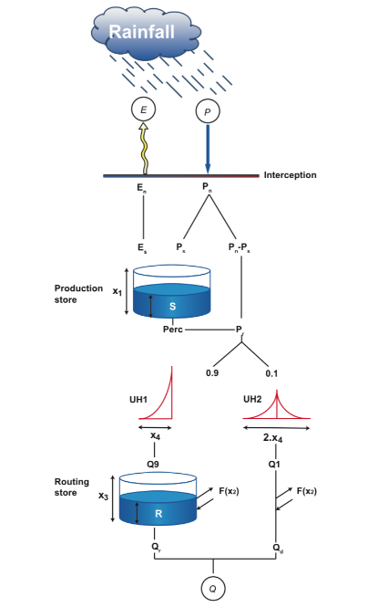

```{r,include=FALSE}
# If include=FALSE, knitr will not display the code in the code chunk above, only its result.
knitr::opts_chunk$set(echo = TRUE)
```

**This is the framework to write the reports expected for BE2 Engineering Hydrology (sessions 1 and 2).**

**The reports are to be returned after the two sessions. See the introduction of the second session to know the date of delivery and the content of the expected reports.**

**The first session of this BE is organized in four parts :**

-   **Part 1 "Basin and times series":** Use command lines to read data, extract information about the basin and the time series, produce summary statistical data, determine the hydrological regime of the river. [***The produced information will be used to write the basin presentation part of the final report***]{.underline}.

-   **Part 2 "Graphic user interface":** Use a graphic user interface to understand how to calibrate a model.

-   **Part 3 "Command lines":** Use command lines to calibrate a model and to simulate a period.

-   **Part 4 "Hydrological model type"**: Questions to ask yourselves when determining a hydrological model type.\
    [***The produced information will be used to write the model presentation part of the final report***]{.underline}***.***

------------------------------------------------------------------------

[**Objective of this session:**]{.underline}

-   Become familiar with the airGRteaching package

-   Run a rainfall-runoff model

-   Calibrate a rainfall-runoff model

***R commands are already written but you will have to fill in the commands with the right arguments.\
(replace "..." by the right argument)***

Install the airGRteaching library if it is not already installed (uncomment the line before execution)\
This run only needs to be run once to install the package (comment the line again after execution).\
Add/delete hashtag "\#" to comment/uncomment line.

```{r, echo=FALSE}
# install.package("airGRteaching")
```

------------------------------------------------------------------------

# 1- Basin and time series

## Data import

Set your working directory and check it

```{r eval=FALSE, include=FALSE}
setwd("F:/Ense3/1. 1st Semester/Engineering Hydrology/3. BE Project/BE2")
getwd("F:/Ense3/1. 1st Semester/Engineering Hydrology/3. BE Project/BE2")
```

Load the airGRteaching library

```{r}
library("airGRteaching")
```

Read the data included in the airGRteaching package for basin L0123001

```{r}
data(L0123001)
```

The last command imports two lists:

-   a first list of information about the basin : BasinInfo

-   a second list of observed time series : BasinObs

------------------------------------------------------------------------

## Basin information

1.  Display the information about this basin with function *str()*

```{r}
str(BasinInfo)
max(BasinObs$T)
```

The watershed has an area of 360 KM^2^. The highest elevation in the watershed is 1278m and the lowest elevation is 286m.

    ***NB: The Blue River is a fictional basin, do not look for a location map.***

2.  Plot the hypsometric curve as a line of thickness 3 without dots.\
    Indicate "L0123001- hypsometric curve" as the main title, "Area percentage" as the x-axis label, "Elevation (meters over msl)" as the y-axis label, and bound your axes as follows: x=[0:100] and y=[200:1400]. Add a graduation grid with function *grid()*.

    *HypsoData is the **hypsometric curve**. It is the distribution of the elevation depending on the area percentage (from 0 to 100%). [ \*\*It tells what percentage of area is above a specific value.]*\*\*

    ```{r}
    plot(BasinInfo$HypsoData,
         main = "L0123001- Hypsometric curve",
         ylab = "Elevation (meters over msl)",xlab="Area percentage",
         xlim=c(0,100),ylim=c(200,1400),
         type="l", lwd=3)
    ```

    From the above graph, it can be concluded that approximately 50% of the area in the watershed is above 600m above MSL (Mean sea level). From this a hypothesis can be derived that as the heights in the watershed are high, so it could be inferred as a mountainous area.

3.  Find the median and maximum elevations for this basin

    ```{r}
    median(BasinInfo$HypsoData)
    max(BasinInfo$HypsoData)
    ```

    The median hereby confirms our inference that 50 % of the land is approximately 600m above MSL.

4.  [In the rest of the BE, we will consider that it is a low-land basin. **Justify this choice**.]{.underline}

    *We are making this consideration as, if we consider it as high land basin than there is a factor of snow production which can effect the process of surface runoff and discharge in the river.*

## Data description

1.  Display the information about the hydrometeorological observed time series in the basin:

    a.  Display the internal structure of the data *BasinObs*

    ```{r}
    str(BasinObs)
    ```

    b.  Display the first rows of the dataframe with function *head()*

    ```{r}
    head(BasinObs)
    ```

    c.  Display the start and end dates of the time series

    ```{r}
    min(BasinObs$DatesR)
    max(BasinObs$DatesR)
    ```

    [Give a brief description of the data.frame]{.underline} :

    -   number of variables

    There are **6** Variables in the Data frame.

    -   number of observations

    There are **10593** observations in the data frame

    -   for each variable : name, type, unit, description

        | S.No | Variable |  Type   |     unit     |            Description            |
        |:----:|:--------:|:-------:|:------------:|:---------------------------------:|
        |  1   |  DatesR  | POSIXct |     UTC      |        Date of Observation        |
        |  2   |    P     |   num   | mm/time step |       Average precipitation       |
        |  3   |    T     |   num   |     ^0^C     | Catchment average air temperature |
        |  4   |    E     |   num   | mm/time step | Catchment average air temperature |
        |  5   |   Qls    |   int   |     l/s      |         Outlet Discharge          |
        |  6   |   Qmm    |   num   | mm/time step |         Outlet discharge          |

    -   for period : time step, first date, last date

        The time step is **daily,** starting from **1984-01-01** till **2012-12-31.**

    Help yourself with the following online section:\
    [\<https://cran.r-project.org/web/packages/airGRteaching/vignettes/get_started.html\>](https://cran.r-project.org/web/packages/airGRteaching/vignettes/get_started.html){.uri}

2.  Display the basic statistical values of the data

    ```{r}
    summary(BasinObs)
    QlsperNA <- ((802+772)/10593)*100
    print(QlsperNA)
    ```

```{r}
library(viridis)
plot(BasinObs$DatesR, BasinObs$Qls, xlab = 'Years', ylab = 'Qls (m3/sec)', main = "Time Series", lty = 1, cex = 0.50, col = viridis(n=256, option = "D"))
```

    
    [Detect the time series that have NA values and give the percentage of missing data.\
        Look at the orders of magnitude of your different variables.]{.underline}

    \*\*Discharge (Qls) and Discharge (mm/time step) series has the missing values and the percentage of missing values is [14.86%.]{.underline}

3.  Calculate the mean precipitation, potential evapotranspiration and flow (in mm), removing the missing values when needed:

    ```{r}
    Pm=mean(BasinObs$P)
    Em=mean(BasinObs$E)
    Qm=mean(BasinObs$Qmm,na.rm=T)
    print(c(Pm,Em,Qm))
    ```

    [Calculate a simple water balance and the runoff coefficient.]{.underline}

    *The law of **water balance** states that the inflows to any water system or area are equal to its outflows plus its change in storage during a time interval.* *The **runoff coefficient** is a dimensionless coefficient relating the amount of runoff to the amount of precipitation received.*

    ```{r}
    WaterBalance=Pm-Em-Qm
    print(WaterBalance)
    ```

    The negative sign of the water balance shows that the amount of rainfall system received was less than the losses of the system.

    ```{r}
    RunoffCoeff= Qm/Pm
    print(RunoffCoeff)
    ```

    The runoff coefficient of 0.5 suggest that 50 % of the rainfall that the system receives is converted to flow (Qm). Hence we can say that the response of the system is moderate.

    *NB: To be rigorous, we would have detected the years with too many missing data and eliminated them from the sample. But the idea here is to quickly detect inconsistencies in the data and to evaluate the interest of doing further tests.*

    [Write a brief opinion on the consistency of these values.]{.underline}

    From the summary, the opinion deduced regarding the consistency is that, mean and median of temperature and Evapotranspiration values are very close to each other which suggest that there is not that much variation in the data. But if we see the precipitation and discharge data there exist an unavoidable difference between the mean and median which suggest that there exist fluctuation in data, such that they are not consistent.

## Hydrological regime

1.  Extract a new vector BasinObsQ containing the observations only for the dates with a discharge value

    ```{r}
    BasinObsQ<-BasinObs[which(!is.na(BasinObs$Qls)),] 
    ```

    ```{r}
    # BasinObsQ<-BasinObs[is.na(BasinObs$Qls)==...,]
    ```

2.  Calculate the average monthly discharge in m3/s

    ```{r}
    Qmonth<-aggregate(BasinObsQ$Qls/1000, list(format(BasinObsQ$DatesR,"%m")), FUN=mean)
    colnames(Qmonth)<-c("Month","Qm3s")
    summary(Qmonth)
    ```

3.  Plot an histogram of the average monthly discharge

```{r}
    plot(Qmonth$Qm3s,
         main = "L0123001- hydrological regime",
         ylab = "Average monthly discharge in m3/s",xlab="Month",
         xlim=c(1,12),ylim=c(0,12),
         type="h", lwd=10)
```

From figure above we can see that highest discharge is in the winter months (December to February) and lower are in the summer months (June to August), which is common trend in most of the rivers. This lower discharge could be due to dry soil and due to higher evapotranspiration process, the lower evapotranspiration hypothesis is also due to the negative water balance we achieved. One hypothesis of greater agriculture activity during the summer season could be a factor for lower discharge as initial abstraction increases.

4.  Calculate the average monthly precipitation in mm

    ```{r}
    Psum<-aggregate(BasinObs$P, list(format(BasinObs$DatesR, "%Y-%m")), FUN=sum) 
    colnames(Psum)<-c("Date","P")
    Psum$Date <- as.POSIXct(paste(Psum$Date,"01",sep="-")) # paste is used for concatenating/ binding the                                                               strings together" , # if we do not write                                                               as.PosIexct then it wont show it as date
    Pmonth<-aggregate(Psum$P, list(format(Psum$Date,"%m")), FUN=mean)
    summary(Pmonth)
    ```

    Plot an histogram of the average monthly precipitation

    ```{r}
    plot(Pmonth,
         main = "L0123001- pluvial regime",
         ylab = "Average monthly precipitation in mm",xlab="Month",
         xlim=c(1,12),ylim=c(0,120),
         type="h", lwd=10)
    ```

    From the figure above we see that the precipitation is subjected to a factor of seasonality with more rainfall in the summer months as compared to winter months. The trend even fortifies the hypothesis that even after having higher rainfall in summer months the discharge is lower because of high evapotranspiration and dry state of the soil or higher agriculture activity.

5.  Identify the hydrological regime of the river and add a comment about spring values using the precipitation regime.\
    The river has a pluvial regime as it has high water in winter and spring, lower discharge in summer and greater inter-annual variability. The spring months are from March to May, the rainfall in these months increases, so as the discharge. (<https://en.wikipedia.org/wiki/River_regime>)

## Data preparation

1.  Prepare a data.frame for the function "PrepGR":

    a.  Look up the help for function "PrepGR" from the package "airGRteaching" in the console (make sure that the package is loaded in the console).

    b.  Prepare a dataframe with the right format (argument obsDF). Select and order columns in a new dataframe named "BasinObs2"

    ```{r}
    BasinObs2 <- BasinObs[,c("DatesR","P","E","Qmm","T")]
    ```

    c.  Use the PrepGR function to select the "GR4J" hydrological model without activating its "Cemaneige" snow module.

    ```{r}
    PREP <- PrepGR(ObsDF = BasinObs2, HydroModel = "GR4J", CemaNeige = FALSE)
    ```

    d.  Check the type of object returned by the function

    ```{r}
    is(PREP)
    typeof(PREP)
    ```

    e.  Display the internal structure of the object in a compact way

    ```{r}
    str(PREP)
    ```

2.  Plot a graph with precipitation and flow time series from PREP with main title "L0123001 - Observation"

    ```{r}
    plot(PREP,main="L0123001 - Observation")
    ```

    The above graph plots the precipitation and flow against the time, this temporal distribution allow us to observe the trend of precipitation and discharge with respect to time.

    *NB: By using the airGR object, you are using the plot() function from the airGR package by default.*

------------------------------------------------------------------------

# 2 - Graphic user interface (GUI)

Run the GUI and load the data "BasinObs2" over the period 01/01/1194-31/12/1994.

[***Uncomment/Comment the R code before/after execution of "knit".***]{.underline}

```{r}
# ShinyGR(ObsDF = BasinObs2, SimPer = c("1994-01-01", "1998-12-31"),NamesObsBV = "Low-land basin")
```

*Your default internet browser should open directly and display the GUI.\
For example:*\
**---------------------------\
Loading required package: shiny\
Listening on <http://127.0.0.1:5871>\
---------------------------**

*Warning: the port number after [[http://127.0.0.1]{.underline}](http://127.0.0.1)is different for each session*

Depending on the package version, the interface may be slightly different.\
Now explore the functionality of the interface and calibrate the GR4J model.

To stop the GUI, return to the R console on RStudio and click on the "Stop" button in the top right corner of the frame.

------------------------------------------------------------------------

# 3 - Command lines

## Calibrate the model

1.  Look up the help for function "CalGR" in the console.

2.  Use the CalGR function and select the Nash-Sutcliffe Efficiency (NSE) criterion, the default warmup period and a calibration period from 01/01/1994 to 31/12/1998.

    ```{r}
    CAL <- CalGR(PrepGR = PREP, CalCrit = "NSE", WupPer = NULL, CalPer = c("1994-01-01", "1998-12-31"))
    ```

    check the type of object returned by the function

    ```{r}
    is(CAL)
    typeof(CAL)
    ```

    Display the internal structure of the object in a compact way

    ```{r}
    str(CAL)
    ```

3.  Look at the performance of the calibration. Find in the 'OutputsCalib' attribute the type of criterion and its final value, the number of iteration and the final set of parameter values

    ```{r}
    CAL$OutputsCalib$CritName
    CAL$OutputsCalib$CritFinal
    CAL$OutputsCalib$NIter
    CAL$OutputsCalib$ParamFinalR
    ```

4.  The calibration performed by the NSE function [Q] is a robust one as it suggests that the model mean (from Qsim) is 81 % in coherence with the observed mean.\
    Report parameters in the table below:]{.underline}

    | X1         | X2       | X3        | X4       |
    |------------|----------|-----------|----------|
    | 249.635037 | 0.956116 | 76.707539 | 2.246997 |

5.  Assess the calibration process by plotting relevant graphs:

    a.  Plot the performance graph

    ```{r}
    plot(CAL, which = "perf")
    ```

    b.  Plot the iteration graph

    ```{r}
    plot(CAL, which = "iter")
    ```

From the performance graph we observe that the discharge time series, visually looks like the simulated flow superimposes the observed flow. Also the rolling mean graphs illustrates that for both simulated and observed series follow the same trend, which is higher flows in winter and low flows in summer. The graph between non-exceedance probability for both the simulated and observed series is almost similar for higher values of flow while for lower values of flow the non-exceedance probability for both the series differ. The other graph represents evolution of parameters with respect to iterations and it could be observed that X1, X3 and X4 becomes consistent between 15-20 iterations while X4 becomes consistent only after 10 iteration. From this graph we can also observe that the maximum efficiency by NSE[Q] is 81.5% and it corresponds to iteration greater than 10.

## Simulate a period

1.  Look up the help for function "SimGR" in the console and see the different arguments.

2.  Use SimGR with the calibrated model and define the simulation period from 01/01/1999 to 31/12/2000, the default warmup period and choose the NSE criterion to evaluate the quality of the simulation.

    ```{r}
    SIM <- SimGR(PrepGR = PREP , CalGR = CAL, EffCrit = "NSE", WupPer = NULL,
    SimPer = c("1999-01-01", "2000-12-31"))
    ```

    Check the type of object returned by the function

    ```{r}
    is(SIM)
    typeof(SIM)
    ```

    Display the internal structure of the object in a compact way

    ```{r}
    str(SIM)
    ```

3.  Look at the performance of the simulation. Identify with the 'EffCrit' attribute the criterion used to evaluate the simulation and its value

    ```{r}
    SIM$EffCrit$CritName
    SIM$EffCrit$CritValue
    ```

The Qsim obtained from the SimGR function is less robust than the Qsim obtain from the CalGR, the reason for this is based on the NSE [Q] values, as for the former case [SImGR] it is 77 % while for the later case [CalGR] it is 81.5 %

4.  Plot graphs to perform a diagnostic of the simulation:

    a.  Plot a static graph:

    ```{r}
    plot(SIM)
    ```

    b.  Plot a dynamic graph with main title 'Simulation'\
        [***Uncomment/Comment the line before/after execution to "knit" the file.***]{.underline}

    ```{r}
    dyplot(SIM, main = "Simulation")
    ```

From the performance graph we observe that the discharge time series, visually looks like the simulated flow superimposes the observed flow. Also the rolling mean graphs illustrates that for both simulated and observed series follow the same trend, which is higher flows in winter and low flows in summer. The graph between non-exceedance probability and flow for both the simulated and observed series is almost similar for higher values of flow while for lower values of flow the exceedance probability for both the series differ. But if we compare the performance graph of SimGR function and CalGR function, the later one gives more robust results.

------------------------------------------------------------------------

# 4- Hydrological model type

***This part is necessary for the BE but can be done at home before the second session.***

The model used for these two work sessions is the GR4J model. This model is part of a series of models developed by INRAE: <https://webgr.inrae.fr/en/models/>

Read the description of the GR4J model:

<https://webgr.inrae.fr/en/models/daily-hydrological-model-gr4j/>\
<https://webgr.inrae.fr/en/models/daily-hydrological-model-gr4j/description-of-the-gr4j-model/>

Identify:

-   its time-step, the necessary input data and the output data

    The GR4J model is a daily time-step model

    The input data are the precipition and the potential evapotranspiration

    The output data is total streamflow

-   its spatial structure (global, semi-distributed or distributed)

    The model is a global spatial structure

-   its way of representing hydrological processes (conceptual mode or physical equation)

    It is a conceptual model

-   its way of representing basin structure (conceptual reservoirs or physical layers)

    It represent a conceptual reservoirs basin structure.

-   its number of parameters to calibrate and their definition

    X1: the production store maximal capacity (mm),

    X2: the catchment water exchange coefficient (mm/day),

    X3: the one-day maximal capacity of the routing reservoir (mm),

    X4: the HU1 unit hydro graph time base (days).

[Write a brief description of the model and insert its diagram.]{.underline}

GR4J is a conceptual water balance model which means it defines the conceptual phenomenon that how rainfall and runoff occurs but it does not define the physical process by using any physical equations. It relates runoff to rainfall and evapotranspiration using daily data. The inputs to the model are precipitation and potential evaporation and gives discharge as the output. It uses a global spatial structure i.e like a lumped model and the limitation of this consideration is that it cannot take into account heterogeneity. It is based on two reservoir model with 4 following parameters.

X1: the production store maximal capacity (mm),

X2: the catchment water exchange coefficient (mm/day),

X3: the one-day maximal capacity of the routing reservoir (mm),

X4: the HU1 unit hydro graph time base (days)


